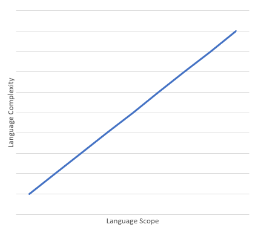

# VA

My Vertiefungsarbeit (In-depth work) on the topic of language complexity and
scope.

## Topic
The topic I have chosen is the relationship between language complexity (vocabulary, inflection, phonology, etc.) and its scope, i.e. what contexts the language is
applicable in. E.g. If I had a language that only had three words:

| Word | Meaning |
|------|---------|
| ik   | I, Me   |
| puke | Burger  |
| uila | To Want |

The only context this language could really be used in, is if I want a burger.

The hypothesis is that this is a (fairly) linear relationship:

